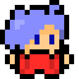
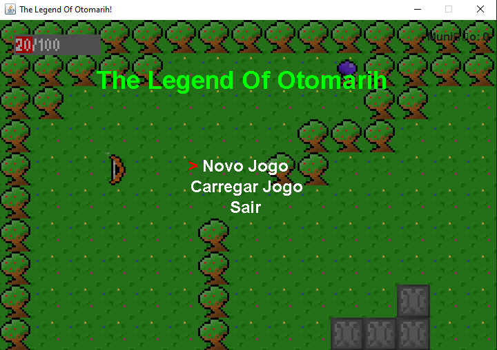
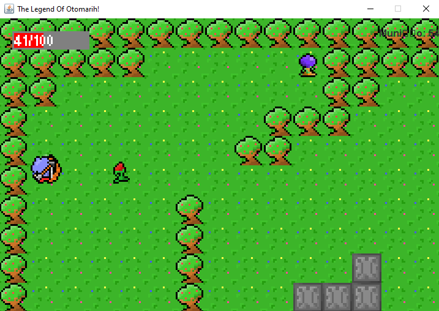
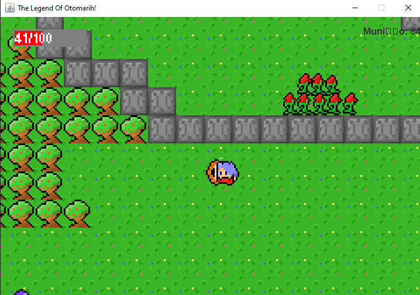

<!-- Usei este modelo como base de edição: https://github.com/othneildrew/Best-README-Template -->
<a id="readme-top"></a>

<!-- PROJECT LOGO -->
<br />
<div align="center">
  
  
  <h2 align="center">The Legend of Otomarih</h2>

  <p align="center">
    This is my first ever game!
    <br/>
  </p>
</div>
<!-- END: PROJECT LOGO -->

<!-- Tabela de resumo -->
<details>
  <summary>Summary</summary>
  <ol>
    <!-- Primeiro: About -->
    <li>
      <a href="#about-the-project">About the Project</a>
      <ul>
        <li><a href="#build-with">Build With</a></li>
      </ul>
    </li>
    <!-- Segundo: Descrição (com sublista) -->
    <li>
      <a href="#getting-started">Getting Started</a>
      <ul>
        <li><a href="#prerequisites">Prerequisites</a></li>
      </ul>
      <ul>
        <li><a href="#installation">Installation</a></li>
      </ul>
    </li>
    <!-- Quarto: Como executar o projeto -->
    <li>
      <a href="#screenshots">Screenshots</a>
    </li>
    <!-- Sétimo: Futuras Melhorias -->
    <li>
      <a href="#future-plans">Future Plans</a>
    </li>
    <!-- Oitavo: Licença -->
    <li>
      <a href="#license">License</a>
    </li>
  </ol>
</details>
<!-- END: Tabela de resumo -->

<!-- SOBRE O PROJETO -->
## About The Project
This was my first game, and one of the earliest codes I've ever made, so its very messy and confusing. I do plan to revisit this project to make it better to understand, but in that time, I didnt know how to use a library nor architecture, so, it gonna be as it is for a long time. The Legend of Otomarih was build with a lot of lore in mind, but my self from 2020 wast able to implement it. Anyways, it was amazing to learn code and gamedev through this project.
</br>

<!-- Funcionalidades -->
#### Build With
Well, the game was only done with Java, back then, I didnt know how to use any library, nor import them with gradle XD

- **Java** 

<!-- END: Funcionalidades -->

<p align="right">(<a href="#readme-top">top</a>)</p>
<!-- END: Descrição de projeto -->

<!-- Como Executar o Projeto -->
## Getting Started
### Prerequisites
- **JDK 17+** If you are planning on build and run
- **Java**  To run the builded one on `/build` folder
### Installation
1. Clone the repo ```git clone https://github.com/MalcolnLMR/the-legend-of-otomarih.git```
2. Open with an Java IDE
3. Run game.java
4. Have fun :D

<p align="right">(<a href="#readme-top">top</a>)</p>
<!-- END: Como Executar o Projeto -->

<!-- Capturas de tela -->
## Screenshots
*please, keep in mind that this was my first game, so its mid*
<div align="center">
  
  
  
</div>

<p align="right">(<a href="#readme-top">top</a>)</p>
<!-- END: Capturas de tela -->

<!-- Futuras Melhorias -->
## Future Plans
1. English version (yes, the menu is in brazillian portuguese only)
2. 2 more levels and a boss battle
3. Music and SFX

<p align="right">(<a href="#readme-top">top</a>)</p>
<!-- END: Futuras Melhorias -->

<!-- LICENSE -->
## License

Distributed under the GPL-3.0. See `LICENSE.txt` for more information.

<p align="right">(<a href="#readme-top">top</a>)</p>
<!-- END: LICENSE -->
